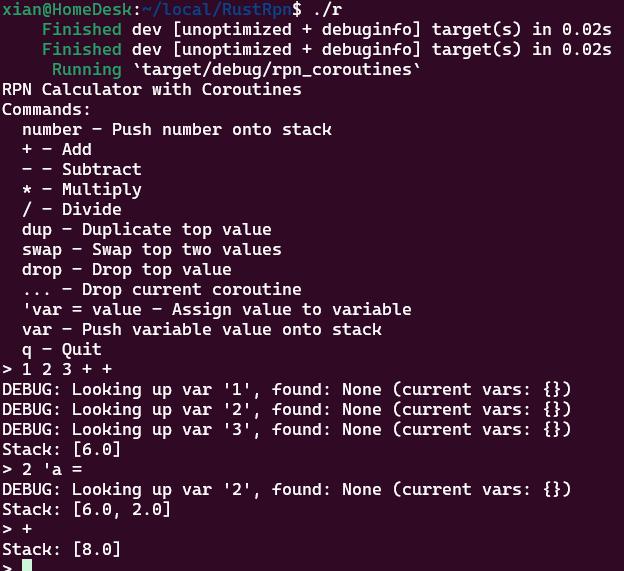

# Stack-Based Calculator Framework

This is a Rust-based stack-based calculator framework that supports basic arithmetic operations, coroutines, stack inspection, and scoped variables.

## Features



### Supported Operations
- **Basic Arithmetic**:
  - `+`: Addition
  - `-`: Subtraction
  - `*`: Multiplication
  - `/`: Division (with division-by-zero protection)

- **Stack Inspection**:
  - `depth`: Prints the number of elements in the data stack.
  - `pick N`: Retrieves the Nth entry from the data stack (0-indexed from the top) without modifying it.

- **Variables**:
  - Declare variables using `'var_name`.
  - Retrieve variable values by referencing their name.

- **Coroutines**:
  - Define coroutines with `{}`.
  - Execute coroutines with `exec`.

### Example Usage
#### Basic Arithmetic
```plaintext
> 1 2 +
Data Stack:
[0] 3.00
Context Stack:
[empty]
```

#### Stack Inspection
```plaintext
> 1 2 3 depth
Stack depth: 3
Data Stack:
[0] 3.00
[1] 2.00
[2] 1.00
Context Stack:
[empty]

> pick 1
Picked: Number(2.00)
```

#### Coroutines and Variables
```plaintext
> 1 'x
> { x 2 * } exec
Data Stack:
[0] 2.00
Context Stack:
[empty]
```

### Building and Running
1. Clone the repository.
2. Navigate to the project directory.
3. Build the project:
   ```bash
   cargo build
   ```
4. Run the REPL:
   ```bash
   cargo run
   ```

### Project Structure
- **`src/main.rs`**:
  Entry point of the application.
- **`src/stack_calculator.rs`**:
  Implementation of the stack-based calculator.

### Future Enhancements
- Add support for more advanced stack manipulation (e.g., `dup`, `swap`, `drop`).
- Extend coroutine functionality with parameters.

### Contributing
Contributions are welcome! Feel free to submit issues or pull requests.

